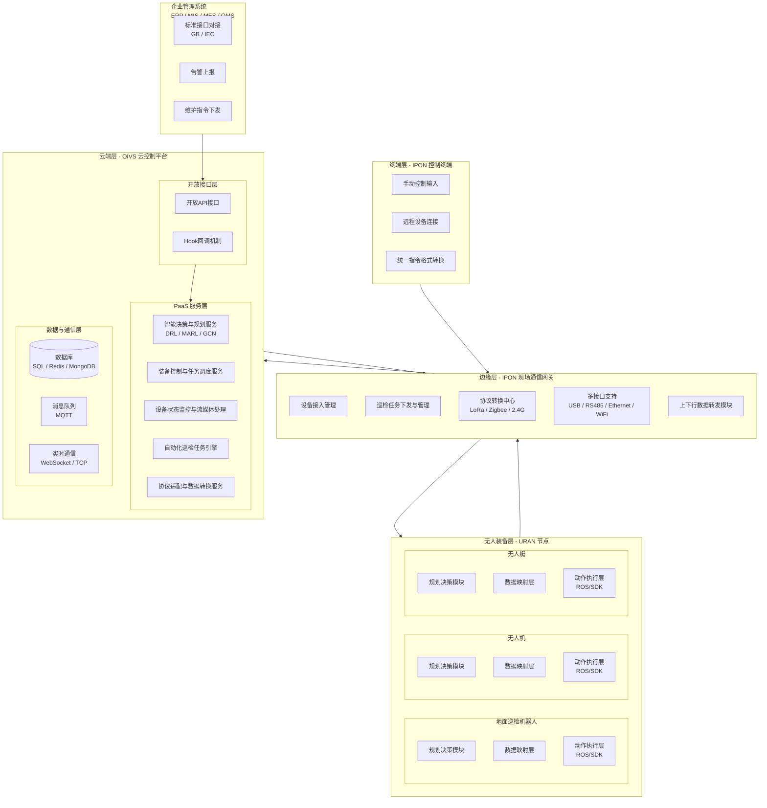

# 芯烛天巡-OIVS系统技术实现要点

## 一、产品定位

“芯烛天巡”是芯烛网络面向能源电力等户外巡检场景，推出的新一代全域巡检警戒系统，旨在解决异构设备接入统一平台的难题。

传统的巡检装备厂家，采取软硬件闭源或闭环的策略进行服务销售，同一生产环境下，不同品牌的设备数据无法互通，信息割裂；近年来，随着智能体技术的发展及新兴领域如机器狗、无人机等的生产厂家，逐步重视开发者生态支持与社区开源，不同品牌之间设备的协同控制具有了初步的技术基础。但从无人装备巡检领域的实际发展情况来看，各设备厂商提供的巡检系统依然仅支持本品牌的巡检装备，难以与其他品牌进行兼容，限制了企业的灵活选择性，且面对不同场所的巡检需求无法由单一装备满足时，引入其他厂商的巡检系统，需再次投入大量的人力、财力，且不同巡检系统之间相对较为孤立，提高了管理成本。

鉴于以上原因，以及出于节省成本与管理便利的考虑，诸多电力、化工等行业的企业在对大面积户外设备进行巡检时，依然在依靠人力完成作业工作，效率低下。  芯烛天巡则创新性地提出了异构设备在同一巡检系统中接入的解决方案，依靠新型多通路组网方式与无人装备的统一化节点部署，能够使得在集控中心及现场的单人手持装备中即可完成对整片区域中所有无人装备的控制操作，并可通过统一化接口自动上报现场传感数据、视频信息，且可基于多智能体协同编队技术的智能决策规划服务实现自动化巡检任务下发。对于电力设施故障、气体泄漏、火灾等难以抵达的或危险场景，可代替人工前行，指挥地面设备和空中设备协同前进，立体侦察，减小危险性，保护生命财产安全。

基于该解决方案，可大幅减少企业接入不同厂家设备进行巡检所需投入的成本，有助于推动无人装备在巡检领域的使用投入，减少人力资源投入，提高巡检效率。此外，市面上暂无通用物联网系统对能源电力等涉及大量户外巡检的场景进行针对性适配，且暂无企业在无人设备统一化接口上进行较为深入的研究探索工作。芯烛天巡可基于OIVS系统、IPON网络、URAN节点等先进技术概念的提出，建立通用化的接口标准，并通过进一步的商业化推广建立行业标准，辅以开发者支持平台及社区开源，形成良好的生态支持，扩大品牌效应，实现正向的商业生态循环。

## 二、系统架构与技术概念解释

### 1. 全域巡检警戒系统

英文名称Omni-Inspection Vigilant System,缩写为OIVS，全域巡检警戒系统是基于IPON网络进行组网，通过通用的标准化接口进行巡检任务下达与协同巡检任务指挥的系统。该系统包含主体控制台与智能决策规划服务，前者主要针对于巡检策略的配置、人工控制等内容，后者则侧重于结合边缘计算设备，智能化的完成巡检任务分配与编队协同。

### 2. 互联巡逻作业网络

英文名称Interconnected Patrol Operations Network,缩写为IPON，互联巡逻作业网络，是完成从云端到现场网关、诸多无人装备通信链路构建的重要组成部分，是将OIVS控制台与无人装备中URAN节点统一起来的中间网络层。

IPON网络按接入方式可分为互联网部分与私有网络部分，互联网部分指的是通过Wifi,Internet,LAN,3G/4G/5G等可接入公共互联网的网络通信技术所进行设备间通信的部分，不依赖于IPON网关设备；私有网络部分则是通过Ethernet,Zigbee,LoRA及其他频段私有协议不接入公共互联网而进行自组网以进行设备间通信的部分，需依赖IPON网关设备。

IPON网络是由多通路、多协议构建的通信系统的网络层抽象总合，不对应单一的、具体的通信网络或组网方式。

### 3. 统一机器人接入节点

英文名称Unified Robotics Access Node,缩写为URAN，统一机器人接入节点是进行IPON网络接入、无人装备控制指令转换下发与数据上传的重要桥接节点。URAN节点以ROS或其他RTOS软件包作为载体，通过一核心软件包完成网络接入功能与向下接口暴露，并允许用户自由安装其他功能扩展包以适配其需求，并支持二次开发。

### 4. 整体架构图

### 5. PaaS与SaaS

PaaS(Platform as a Service)——平台即服务，属于SaaS(Software as a Service)——软件即服务的一种。早年的自助建站平台、游戏私有服务器出售平台，类如MongoDB,Oracle等企业版数据库等的软件服务，都属于SaaS的一种，近年来的阿里云、腾讯云等云厂商出租服务器、物联网平台、云安全产品等的业务也都属于SaaS，其中物联网平台一类的业务属于PaaS。

这两种商业形式是当今互联网行业最常用、最易被大众接受、最易推广的商业形式。

## 三、OIVS系统云端控制台

### 1. 适配于PaaS商业模式的软件架构

PaaS是SaaS的一种，以平台作为服务。需对用户进行分级治理，用户可灵活选择不同的服务版本，如基础版、企业版、企业定制版等；附带出售不同的设备产品。

需对用户进行较为复杂的身份验证逻辑校验、子账号及其权限分配等。

 

### 2. 各用户数据库隔离治理

数据隔离是PaaS平台中确保用户数据安全的重要技术指标，包含物理数据库隔离、数据库Schema隔离、共享数据库逻辑隔离等多种方式。

为平衡经济成本与独立性，芯烛天巡主体平台采用Schema隔离方式，针对需私有部署的定制版客户，则提供物理数据库隔离方式。

隔离治理对数据库操作技术及连接池技术有较高技术要求，需制定特定命名规则并开发相关算法，要求准确且快速的找到相关用户。

数据库隔离的级别应当在OIVS单体最小系统级别。

特别注意：*各租户应当以整体的企业、集团作为主体，则其可能有多个不同地区的户外巡检环境，则应当允许其创建多个控制台实例，且每个实例可单独对应一个子账号！单个控制台实例即对应一个**OIVS**单体最小系统，拥有独立的**IPON**网络，且单个**URAN**节点同时最多只可经**IPON**网络接入到一个**OIVS**单体最小系统中。这意味着单个企业也可能对应着具有多个相互隔离的数据库。*

### 3. 无人设备联网接入

无人设备可通过不同方式接入，整体可划分为直连接入与网关中转接入，具备互联网通信功能的设备可基于MQTT/TCP等协议直接连接到OIVS控制台，而需通过LoRA/NB-IoT等协议进行连接的，则需要首先通过网关设备进行中转。

控制台可创建装备模板，并可建立装备实例，装备模板用于通用型的信息记录，装备实例则对应某一装备实体。

可导入STL,URDF模型等到所创建的装备模板中方便查看，并可预设其传感器及其他数据字段，配置其元数据信息等(物模型)。此外，装备模板可预设控制的线速度、角速度等信息，通过配置下发至通用URAN节点的默认参数来完成配置。（详细可变参数内容参考URAN节点章节的内容）

装备实例对应唯一装备模板，可通过平台预设装备信息接入、未预设信息装备自动接入两种接入方式。装备实例会被记录其在线状态，并可通过URAN节点上报传感数据，若无人装备安装了涉及远程控制等相关的URAN软件包，则可在控制台获取其SSH连接信息或其他端口转发信息。

### 4. 传感数据与媒体流记录

传感数据应当适配URAN-sensor中预设的常见传感器数据类型，方便直接获取，通过监听器判断是否满足触发条件，满足触发条件后记录到装备实例对应的数据库表单中。同时，得益于监听器的灵活配置，用户二次开发的URAN软件包所上传来的数据同样可以进行数据记录。

此外，基于STUN/TURN及WebRTC等技术，适配URAN-media软件包，能够直接完成媒体流传输，并可开启录制功能进行记录。若设备处于自动巡检任务中，同样可设置开启其记录功能，则会等待其通信信号较好时，获取由URAN-media节点录制的任务记录，切片后进行上传。

### 5. URAN节点各模块包适配

(1)    URAN-core状态空间设置

(2)    URAN-core通信协议及报文内容统一化处理

(3)    URAN-move与URAN-media实时控制界面适配

(4)    URAN-frpcpoint反向代理端口分配

通过适配URAN-frpcpoint软件包，控制其frpc在装备上所选取的端口，并在服务器上自动分配端口，完成配对，实现反向隧道代理，可灵活控制其端口映射，常见于SSH服务。

### 6. 系统IPON网络拓扑结构展示

通过网关设备连接状态及装备实例上报的其为直连和网关中转接入的不同方式、所连接到的网关设备的信息，来绘制包含多个OIVS单体最小系统、IPON网关、URAN节点在内的整体拓扑图。

### 7. 系统整体数据展示及大屏展示模式

基于地图服务展示装备的地理位置分布信息，并统计实时在线设备（包含网关与无人装备），统计数据上下行流量、传感数据上报量、上报类型等数据，进行图表可视化展示，并支持切换到大屏展示模式（即在浏览器中由控制台首页图表可视化的样式转变为数据大屏浏览的样式）

## 四、IPON网络与设备组网

### 1. 多协议通路

IPON网络的主要通路存在于互联网当中，对于NB-IoT,LoRA等区域组网的通信协议，则针对无法接入互联网或局域网的设备；此外，针对巡检场景有高安全性、保密性的环境，可本地构建部署私有网络，组件局域网。具体协议包含了TCP,UDP,MQTT,WebSocket,WebRTC,LoRA,NB-IoT,2.4GHz私有协议等，从而构成了IPON网络的多协议通路。

多协议通路有多个优势：一是可以适配多种采用不同协议的无人装备进行控制；二是针对部分支持多种协议通信的装备，可留有冗余通信通路；三是能够允许在不同控制实时性需求下灵活选择基于云端或现场的手持控制台进行控制。

### 2. 拓扑结构

IPON网络的拓扑结构从OIVS单体最小系统来看是星型结构，若某一主体用户下，具有多个不同的巡检场景，则需对应多个OIVS单体系统，组成多星型结构。在某些特殊情况下，可实现无人设备的跨系统协同配合，但需为同一用户主体下的多个OIVS单体最小系统之间。

### 3. ipv6下运控设备安全性探索先行者(实验室模拟)

当前工业级的无人装备多数已配备网卡设备，可通过Wifi/LAN等方式接入互联网，但诸多平台仍停留在ipv4连接阶段。

基于ipv4进行设备控制，由于32位ip地址仅可分配约43亿个地址的限制，绝大多数情况下公网服务器无可直接连接到无人装备的互联网通路，需经过多跳的路由寻址、转发等才可成功交换报文内容，实现控制指令的下发。该过程涉及到了NAT桥接等多种技术，路径相对较长。

而对于ipv6协议，得益于其64位ip地址可分配3.4x1038个地址的数量优势，能够满足地球上每平方米土地分配上千个地址的需求，且当前主流的无人装备如宇树科技、大疆、云深处等企业，在其工业级产品上均支持ipv6接入；此外，我国ipv6基础设施建设较为完备，三大运营商已完成ipv6覆盖。

相比之下，若使用ipv6直连，则可大幅缩短路由路径，尤其针对户外巡检环境，在厂家需要私有网络部署的情况下，相较于ipv4连接方式，可大幅提高实时性与传输效率。

### 4. 网关设备接入

网关设备分为上行与下行通道，专门支持LoRA,Zigbee,及其他包含2.4GHz/40GHz/60GHz等频段的协议，针对无网络连接功能的设备，为下行通道；此外，网关设备通过互联网接入到云端控制台中，转发无人设备报文内容或媒体流到控制台中，为上行通道。

网关设备由芯烛天巡官方提供一类通用的设备，但非强制性使用的设备，为扩展性设备，仍可选择第三方网关设备进行接入，但需进行相关适配操作。

官方提供的网关设备应当具有基本的网络功能，能够与手持终端完成直接连接。此外，应当具有LAN网口、RS485、USB3.0等外部电气接口，以便无法连接到云端控制台时，保证现场环境下可直接控制网关设备。

### 5. 手持终端接入与直连控制

手持终端应当支持两种入网方式，第一种为互联网连接，通过WIFI/4G/

5G信号连接到云端控制台，并兼容ipv6接入，便于实现到无人装备的连接  控制；第二种为网关连接，主要针对无法连接到互联网而需通过其他协议进   行控制的无人装备。

直连控制则基于两种入网方式，向无人装备发送相关的控制切换信令，与手持终端的特殊协议，如LoRA，进行直连配对。此外，对于具备ipv6接入功能的无人装备，通过云端控制台下发控制切换信令，能够实现端到端的网络直连。

手持终端具有管理系统与装备控制台两种主要功能，均在同一软件中实现，管理系统可查看该终端有权限查看的所有装备的状态，下发相关巡检任务，并能够进入可被进行远程控制装备的装备控制台进行直接控制。

装备控制台还应当具有视频录制功能（由云端控制台配置强制或非强制）、日志审计功能（强制）。

## 五、URAN节点及其可扩展性

### 1. IPON网络中扮演的角色及ipv6安全接入探索

URAN节点属于IPON网络星型拓扑结构中的末端子节点，单个URAN节点一般对应于单个装备实例，也就是一个实体设备。

URAN节点通过IPON网络获取控制信令信息，并上传传感数据或视频流画面。获取到控制信令信息后，转发至各个软件包及设备特定的执行机构，完成各逻辑功能。

此外，为便于与手持终端或云端控制台进行直连，应针对支持ipv6的设备进行ipv6连接适配，并研究相关的安全策略，保证设备控制的安全性。

### 2. 面向ROS及其他RTOS的第三方包

鉴于当前可远程控制的工业级无人装备多使用ARM架构，搭载Linux系统并使用ROS作为常见搭配，因而URAN节点主要以ROS软件包的方式进行开发；而小型嵌入式设备仍有可能使用RTOS（实时操作系统），因而需要对Free-RTOS,RT-Thread等常见的IoT所使用的RTOS进行软件包开发适配。

软件包要求为工业级高可靠性产品，具有相对的独立性，有对第三方包引入的package管理，支持直接克隆仓库后编译，要求对不同ROS版本（主要针对于ROS2）均可进行适配。

以下提到的均为单个URAN节点下可对应的多个软件包，均需要以URAN-core为依赖前提。

### 3. URAN-core核心

(1)    状态空间

状态空间是将URAN节点中各个软件包运行时所产生的公共可访问数据、运行状态数据进行集中存储，方便向网关或云端控制台进行上报而设立的数据存储空间。

状态空间中的数据按存储时所主要占用的物理位置划分为持久化与非持久化数据，主要存储在内存中的数据为非持久化数据，主要通过SQLite、csv文件等存储的数据为持久化数据。

状态空间的模板（元数据信息）可在云端控制台进行配置，单个URAN节点启动时，从云端控制台相应的装备模板中获取公共的状态空间元数据信息，并从装备实例中获取特有的状态空间元数据信息（分为追加与覆写两种配置方式）。

需配置相关的服务或topic路径来接收其他ros节点传来的数据以更新状态空间中的数据，并妥善配置数据结构，标明其是否持久化等特征信息。

(2)    基本入网方式配置

URAN-core节点最重要的功能即为协调控制多种不同的IPON网络接入方式，并自动化的切换接入方式或被动改变远程控制者。

应当支持的协议：MQTT连接、WebSocket连接、WebRTC连接、RTSP连接、TCP连接、UDP连接、LoRA、Zigbee、Blueteeth，此外预留其他40GHz,60GHz等不同频段协议接入的接口。

应当默认使用MQTT协议向网关或云端控制台发送心跳包，并可同时支持多个不同协议的连接，针对不同协议，都应当有一个统一格式的心跳包，以便至少有一个协议可经过IPON网络到达云端控制台时都可被判断在线状态（WebRTC协议除外）。

应当规定一个控制切换信令的格式，指定当前的远程控制者、巡检模式（自动、手动）或数据上传的主要传输协议切换到哪一种。

(3)    控制切换

在(2)中已经在末尾提到了需规定相应的格式。

无人装备的控制切换主要包含两种：一是自动或手动巡检模式的切换，二是传感器、状态空间、心跳包等数据的上行传输采用的协议切换及流媒体传输切换。

前者需向URAN-move运控包及URAN-autotask包发送相关信息来完成切换，后者需指定一个开放接口，规定好特定格式，URSAN-sensor及用户二次开发的软件包等可指定传输到云端时采用的协议，如MQTT,Websocket等。

(4)    数据上下行通路

数据上行通路是指URAN节点通过IPON网络将装备实例内部各软件包消息、状态空间中的数据通过其指定协议转发到上层网关设备、云端控制台或从上层网关设备、云端控制台获取数据的双向通路。

数据下行通路是指URAN节点内部，其他各软件包规定上行转发使用的协议后将产生的数据发送至URAN-core软件包节点，或从URAN-core中获取上行通路中的数据转发至各个软件包的双向通路。

需在状态空间中维持一个协议通路表，记录如MQTT，WebSocket，TCP，LoRA等协议到云端控制台或网关设备的通路是否可用，以便接收其他软件包消息后判断能否通过该方式进行转发，若不能，则采用其他备用协议进行转发。

### 4. URAN-move运控包

该运控包需要制定一种较为灵活、可变的控制指令格式，包含运动控制、姿态控制等远程控制方式。

应当首先调研不同的无人装备，如机器狗、无人机、水面舰艇等，并选择不同的生产厂家，选择多种合适的、适配多个自由度的运动或姿态控制指令格式，URAN-move所接收的来自URAN-core所转发的远程控制指令的格式是固定的，在URAN-move节点内部要预设各种不同的常见运控指令格式，并支持切换指令格式，能够直接将远程的统一指令格式转换为无人装备生产厂商规定的特有的指令格式。

此外，需要允许用户自行设定第三方的控制指令转换逻辑，要具有可扩展性，这就要求通过设计特定的头文件或其他格式的文件，而且预设的指令格式的转换，也要以这种能够统一不同转换逻辑的形式存在，相当于芯烛天巡只是官方提供了几个转换逻辑，这样能够保证通用性、可扩展性。

芯烛天巡开放平台的文档中，应当专门说明如何让用户修改指令转换逻辑，完成针对性的二次开发。

### 5. URAN-media流媒体包

流媒体包需针对视频流、音频流做传输适配，主要基于URAN-core的转发作为信令传输。

由于WebRTC协议、RTSP协议等均需要诸多信令传输才能建立流媒体传输通道，因而URAN-media流媒体包主要处理的就是开发特定的信令传输，实现与云端控制台、手持终端设备等的流媒体传输。并且要预留好向第三方应用开放传输通道的接口及架构设计，要至少支持WebRTC,RTSP两种常用的流媒体传输协议。

由于实际无人装备的视频、音频传输的topic各不相同，且数据格式各不相同，因而同样需要预设几种不同的格式转换逻辑（以WebRTC,RTSP所需的格式为准)，或直接向云端控制台/手持终端发送后由远程控制者进行解析不同的格式（需要为常见的、通用的数据格式如BGR,RGB等，非小众数据格式）。此外，仍然需要允许二次开发自定义转换逻辑，需特别注意流媒体传输可能包含视频、音频能多个不同的通道在内，处理多种不同格式，还要注意开发好切换格式转换逻辑的功能，以保证灵活性。

### 6. URAN-sensor传感器包

传感器包主要针对雷达、超声波、测距、点云、GPS等各种含特定格式，非二进制、非媒体流的传感数据进行传输。

可提供逻辑处理接口，订阅不同topic之后，获取数据，之后可直接发送至URAN-core保留在状态空间中或经处理后保留在状态空间中，也可通过转发发送至云端控制台或网关设备中。

芯烛天巡应官方提供一些常见传感器的数据转换逻辑接口，应当具备足够的灵活性、可扩展性，允许用户自定义的开发不同的传感器数据包，并与装备模板进行匹配。且可能同时存在多个不同传感器的数据需进行发送，要允许传输多个不同的传感数据。

### 7. URAN-frpcpoint端口转发控制服务
### 8. URAN-autotask自动化巡检服务与MCP服务接口
### 9. 基于URAN-core接口的二次开发扩展支持

## 六、OIVS系统智能决策与规划服务

### 1. 商业化服务定位(TODO:沙箱仿真环境+免费额度)
### 2. 云端+私有部署双方案
### 3. 宏观巡检方案制定及MCP调用能力
### 4. 边缘设备环境泛化能力与MCP服务接口开发
### 5. 一体化服务架构

## 七、PaaS商业化服务

### 1. 与系统逻辑功能相统一的商业模式
### 2. 分级商业服务
### 3. 设备销售业务
### 4. 现场设备适配与售后服务
### 5. 无人装备经销/代销业务
### 6. 开发者社区支持（TODO:平台免费使用期限审核后赠送，智能规划算法也可免费使用，提供性能较弱的预训练模型）

## 八、竞品分析

### 1. 施耐德电气 EcoStruxure 开放自动化平台 (EAE)

摘要：该平台针对于底层统一，针对电气设备PLC

### 2. 西门子TIA博图

摘要：针对工业生产设备，重点关注工业以太网，不适合当今无人装备的接入方式

### 3. 中能拾贝 CyberwIIOS cloud

摘要：软件与硬件强绑定，开发者自由度低，可扩展性低，依旧基于品牌内部软硬件闭环的策略

## 九、芯烛天巡开放平台(SDK/API)

## 十、未来发展计划

### 1. 网关设备长时间运行验证
### 2. 手持终端长时间运行验证
### 3. 完成CCC与SRRC产品认证
### 4. 完成具有相关需求企业的招投标
### 5. 一体化无人装备扩展组件研发
### 6. 完成天使轮融资
### 7. 组建更为专业的商业营销团队
### 8. 数字资产化巡检管理平台研发
### 9. 多传感器融合的识别算法研发
### 10. 特定行业领域成熟案例推出